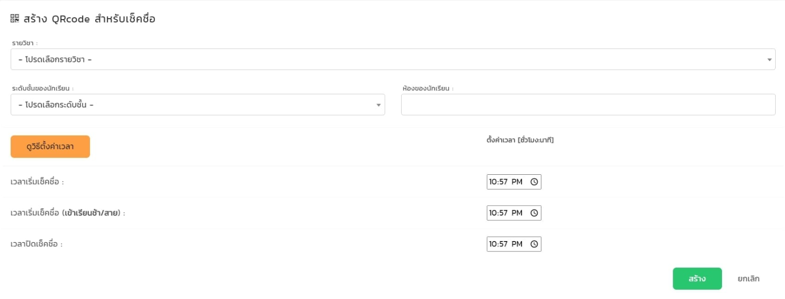
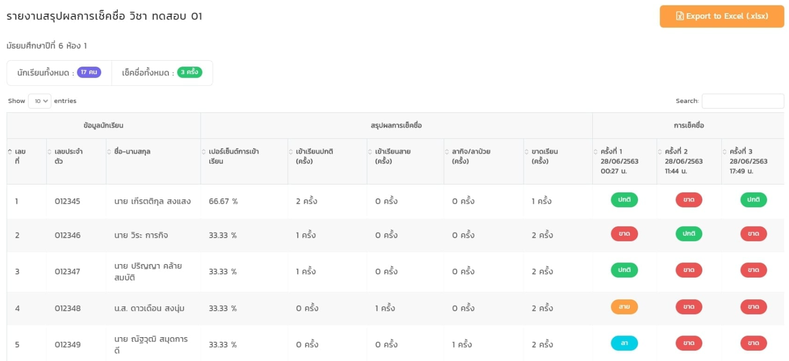
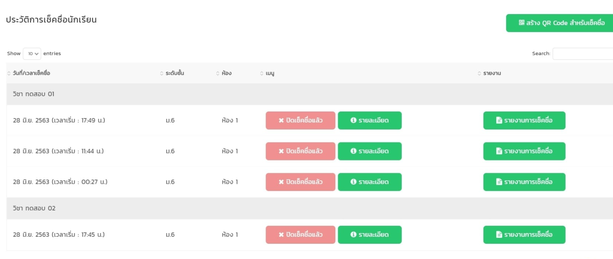

Seeder Student
php artisan db:seed --class=StudentSeeder

table stu_lists คือ table ที่ import csv เข้าไป เป็นชื่อและรหัสนักศึกษา

table subjects คือ table หลักของวิชา เป็นตารางที่เอาไว้เก็บวิชา

table subject_stus เป็น table ที่เก็บ อาจารย์ที่สอน, รหัสวิชา, รหัสน.ศ, ชื่อ เอาไว้เป็นชื่อวิชา และนักศึกษาที่เรียนวิชานี้ อาจารย์จะได้ไม่ต้องเลือก นักศึกษาเองทุกรอบที่จะทำการเช็คชื่อ

[
ตอนนี้ที่ยังขาดคือ table อาจารย์เช็คชื่อ ที่จะเก็บขื่อวิชา เก็บอาจารย์ น.ศ และอื่นๆ 
table นี้จะเป็น table ที่เก็บข้อมูลชั่วคราวเช่น
อาจารย์สร้าง qr code มา อาจารย์ได้ตั้งเวลาเริ่ม เข้าสาย และปิดเวลาเช็คชื่อ หลังจากปิดแล้ว ข้อมูลทั้งหมดจะเก็บใน database หลัก ที่เก็บการเช็คชื่อทุกอย่างในนั้น อาจารย์สามารถดู report 

-----------------------------------

-----------------------------------

]

